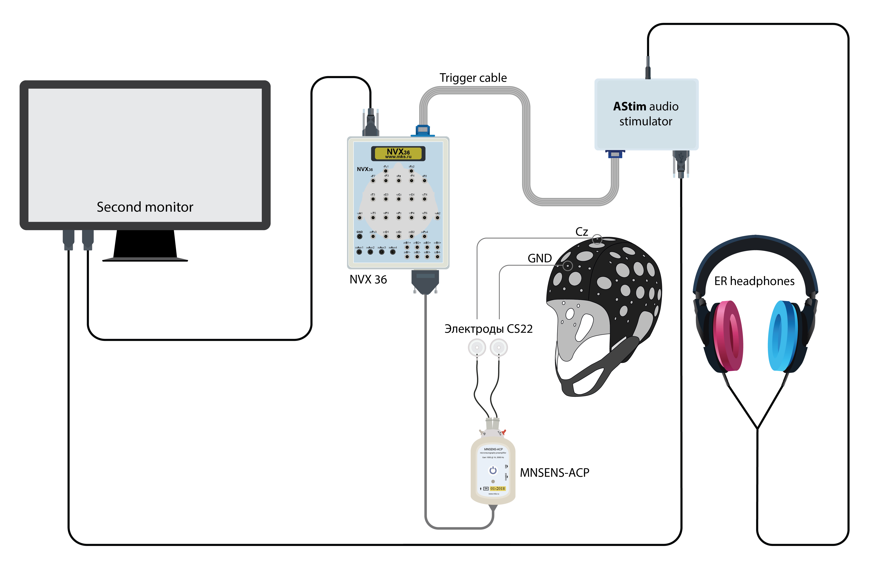
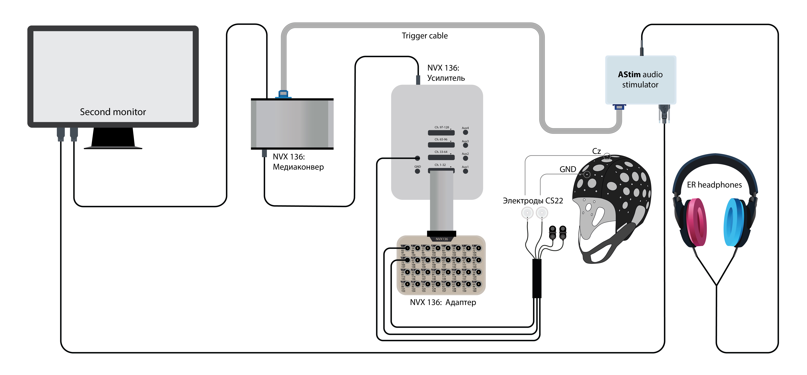

# AStimWavPatcher Example

The repository contains a file showing how to add AStim commands to a WAV file using the Python programming language.
> Attention!  
AStim works _only_ with __16-bit__ WAV files with a sampling rate of __44100 Hz__.

## Script description

The script `wavpatcher.py` writes AStim commands to the right channel of the WAV file.
Two commands are written to the beginning of the file, enabling both the left and right channels. Commands to enable either only left or only right channel are also present in the script, but by default both channels are enabled.
Then trigger 6 is set to LOW. At the end of the file, trigger 6 is set to HIGH.

## Requirements

To run the script you need [Python](https://python.org/) (3.4 or higher), [numpy](https://numpy.org/) and [scipy](https://scipy.org/) packages.

## Usage

The script is run through the command line, as follows
<pre>
$ python wavpatcher.py <i>input_file_path</i> -o <i>output_file_path</i>
</pre>
If `output_file_path` is not specified (by the flag `-o`) input file will be rewritten.  
For a description of the arguments, see the help message, which can be shown by running with the `-h` flag.

## AStim Command Description

The commands are 3-bit, each bit is encoded with sequence of two 16-bit samples in the right channel:

    0: -32768 and +32767;
    1: +32767 and -32768.

There should be no gaps between the bits.  
There must be at least one sample with zero value between commands.  
If there are no commands, then there are only zero samples in the right channel.  

If there are zero samples on the right channel, the A-Stim goes into mono (the right channel receives samples from the left channel).  
If there are non-zero samples on the right channel, the A-Stim goes into standard stereo mode.  

Commands:
1) 000 - disable left channel, 001 - enable left channel (default);
2) 010 - disable right channel, 011 - enable right channel (default);
3) 100 - set trigger 6 LOW, 101 - set trigger 6 HIGH (default);
3) 110 - set trigger 7 LOW, 111 - set trigger 7 HIGH (default).

## File examples

The [audio/examples](./audio/examples) folder contains examples of WAV files with added commands in the right channel.  
The file [audio/examples/output_example_1s.wav](./audio/examples/output_example_1s.wav) was obtained by processing the file [audio/origin/input_example_1s.wav](./audio/origin/input_example_1s.wav) by the script [wavpatcher.py](./wavpatcher.py).

# Frequency Following Response Project
https://en.wikipedia.org/wiki/Frequency_following_response

FFR represents a neurophysiological response to an auditory stimulus, reflecting the neural processing of its acoustic parameters with high precision.

## Equipment, software, documentation

AStim https://mks.ru/en/products/ep-erp https://docs.mks.ru/ru/file/682f7130953d8#to-docs

NVX 36 https://mks.ru/en/products/nvx

NVX 136 https://mks.ru/en/products/nvx-136

MCScap https://mks.ru/en/products/mcscap

Electrodes MCScap-CS22 https://mcscap.ru/catalog/tes-elektrody-dlya-stimulyatsii/mcscap-cs22/

NeoRec 1.6 https://docs.mks.ru/en/file/65dd0ac5d6895#to-docs

Frequency_Following_Response_Astim Version 1 https://github.com/asmyasikova83/Frequency_Following_Response_Astim.git

Detailed description and instruction for Frequency_Following_Response_Astim Version 1 https://docs.mks.ru/download/6a50e1d6de9d5

## EEG setup for ASTIM + NVX 36 suite

## EEG setup for ASTIM + NVX 136 suite

The WAV file with audio stimuli was generated using ASTIM commands in the right channel of the WAV file.
To eliminate bone‑conduction artifacts, two types of triggers were used: trigger 6 with the original stimulus
and trigger 7 with the inverted stimulus. 
At the beginning of each stimulus trigger 6 (7) is set to LOW. At the end of the stimulus, trigger 6(7) is set to HIGH. 

WAV file https://docs.mks.ru/en/file/6a575b8d86e5e#to-docs

## Audio stimuli generation

Script create_wav.py from Frequency_Following_Response_Astim Version 1 creates WAV with audio stimuli:
Da syllable or sinusoidal tones with a predefined range of frequencies

Example call:
           python create_wav.py  --function multiple_sin --F 110 220 440 880 --TS 100 --TP 100 --N 2 --INV 0

           python create_wav.py  --function repeated_da  --TS 100 --TP 100 --N 100 --INV 1 --wavfname '\\MCSSERVER\DB Temp\physionet.org\FFR\stim\DA+20.wav' 

--F frequency

--TS stimulus latency

--TP interstimulus interval (pause) latency

--N number of stimulus repetitions

--INV add polar (inverted) stimulus

--wavfname path to an example of syllable to be multiplied and wrapped into audio stimulation

## Preprocessing and visualization of FFR

Script command_line_ffr.py creates PDF with a plot of the stimulus, its spectra, grand average of FFR  
and FFR spectra, respectively. Additionally, the correlation coefficient R of stimulus waveform and FFR
waveform over averages is shown. Relative power of FFR spectral peaks over averages is also visualized. 
Data (bfd/fif) and associated stimuli (wav) are selected interactively.

Example call:
        python command_line_ffr.py --TS 250 --TP 200 --fmin 80 --fmax 1500 --tmin -100 --tmax 300 --N 500

## Requirements

        matplotlib==3.8.4
        mne==1.12.1
        numpy==2.3.4
        pandas==2.3.3
        pypdf==6.13.1
        reportlab==4.5.1
        scipy==1.16.3

